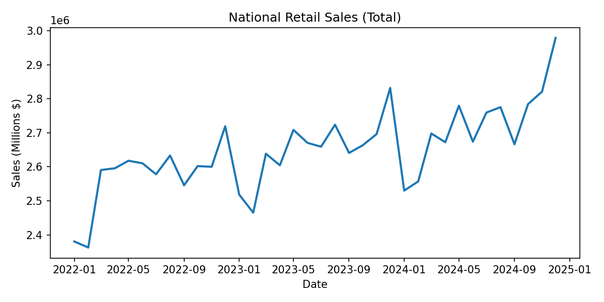
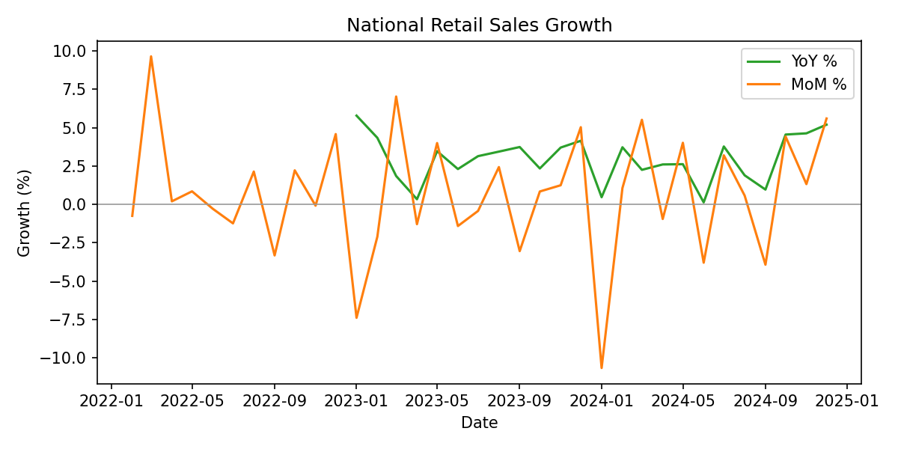

# Market Growth & Competitive Dynamics Analysis (US Retail Market)

## Executive Summary
- National retail sales hit **$2.98T** in **Dec 2024**; average **$2.72T** over the last 12 months, with clear year-end seasonality.
- **YoY growth = 5.19%** in Dec 2024 (12‑month avg **2.73%**); **MoM = 5.59%** (avg **0.53%**).
- The **South** contributed **34.0%** of positive YoY growth in **2024 H2** (all‑industry).
- **Top 5 states** accounted for **28.0%** of positive growth in **Dec 2024**, **down 8.2pp** vs Dec 2023.
- **Motor Vehicles & Parts** led 2024 with the highest average YoY growth (**2.92%**).

## Key Outputs (Quick Review)
- Metrics snapshot: `docs/metrics_snapshot.csv`

### Tableau Dashboards (Static Exports)

## Business Context
This project evaluates whether the US retail market is growing, where that growth originates, and how concentrated the market has become. The goal is to deliver decision-ready insights that mirror how internal Market/Strategy teams report market size, growth drivers, and concentration risk.

## Data Overview
**Primary datasets (official sources):**
- U.S. Census Bureau — Monthly Retail Trade Survey (MRTS) for national sales levels
- U.S. Census Bureau — Monthly State Retail Sales (MSRS) for state-level YoY growth rates

**Analysis-ready tables (two fact tables, not joined):**
1) `fact_national_retail_sales` (Market Size / Level)
   - `date` (YYYY-MM)
   - `industry`
   - `sales_amount` (national monthly sales level from MRTS)

2) `fact_state_retail_growth` (State Growth Structure / Rate)
   - `date` (YYYY-MM)
   - `state` (CA, TX, NY, ...)
   - `region` (West, South, Midwest, Northeast)
   - `industry`
   - `yoy_pct` (state-level YoY % from MSRS)

**Reporting standard note:**  
State-level growth data is aggregated at the **state–industry–month** level, while national market size is reported at the **industry–month** level, reflecting real-world reporting standards.

**Consistency note:**  
Industry categories are aligned across sources using a standardized retail classification to ensure consistency.

**Data publication constraint note:**  
Due to data publication constraints, market size and growth structure are analyzed using two complementary official sources. National retail sales levels are sourced from MRTS, while state-level growth dynamics are captured using MSRS year-over-year percentage changes.
  
**Growth contribution note:**  
Growth contribution is calculated by normalizing positive year-over-year growth rates only, ensuring that contributions reflect sources of expansion rather than contraction.

**Aggregation note (MSRS):**  
When multiple NAICS codes map to one industry group (e.g., Other Specialty Retail), YoY % is averaged (unweighted) at the state–month–group level due to lack of level weights.

**Source config:**  
Official source URLs are locked in `config/data_sources.yaml` for reproducibility.

**Industry standardization (analysis layer):**
- Food & Beverage Stores
- General Merchandise
- Motor Vehicles & Parts
- Clothing & Accessories
- Electronics & Appliances
- Nonstore Retail (E-commerce)
- Other Specialty Retail

**Coverage note:**  
MSRS state data does not currently include NAICS 454 (Nonstore Retail), so state-level outputs may show 6 groups.

## Key Metrics
**Market Size & Growth**
- Total Sales
- YoY Growth
- MoM Growth

**Growth Contribution**
- State contribution (%)
- Region contribution (%)
- Industry contribution (%)

**Concentration & Risk**
- Top 5 / Top 10 states share
- Top industry share
- Growth dependency ratio

## Market Trends
**What is analyzed (SQL / pandas, MRTS):**
- National total sales trend (level)
- YoY / MoM growth (level-based)
- Monthly seasonality patterns

**Tableau dashboard: Market Overview**
- Line chart: Total Sales
- YoY bar chart
- Seasonality heatmap (Month × Year)

**README narrative (market trend takeaway):**  
The US retail market shows steady long-term growth with clear seasonality patterns, indicating a structurally stable but cyclical market.

## Growth Drivers
This is the core value of the project — decomposing growth across three dimensions only (MSRS YoY %):

**a) Regional Contribution**  
Which regions contribute the most to total growth.

**b) State Contribution**  
Top 5 states vs. the rest of the US.

**c) Industry Contribution**  
Which industries are pulling the market forward.

**Tableau dashboard: Growth Breakdown**
- Stacked bar (growth contribution)
- Map (state-level growth)
- Top vs. Long Tail comparison

**README narrative (growth driver takeaway):**  
Growth is primarily driven by a small number of high-performing states, while long-tail regions contribute marginal but stable growth.

## Market Concentration & Risk
**Focus (MSRS YoY %):**
- Top 5 states share of growth
- Top industry share of growth
- Trend of concentration over time

**Tableau dashboard: Risk & Concentration**
- Top N share trend line
- Concentration snapshot
- Risk callout (text)

**README narrative (risk takeaway):**  
Increasing concentration indicates potential systemic risk, where market performance becomes overly dependent on a limited number of regions.

## Insights & Strategic Implications
**Key Insights (2022-01 → 2024-12)**
- **Market size:** Total retail sales reached **$2.98T** in **Dec 2024** (avg **$2.72T** over the last 12 months).
- **Growth momentum:** **Dec 2024 YoY = 5.19%** (last 12-month avg **2.73%**); **MoM = 5.59%** (avg **0.53%**).
- **Seasonality:** **December** is the peak month by average sales (**$2.84T**).
- **Regional driver:** **South** contributed **34.0%** of positive YoY growth in **2024 H2** (all-industry).
- **Concentration risk:** **Top 5 states** accounted for **28.0%** of positive growth in **Dec 2024**, down **8.2pp** vs **Dec 2023**.
- **Industry momentum:** **Motor Vehicles & Parts** led 2024 with the highest average YoY growth (**2.92%**).

**Strategic Implications**
- **Where to invest:** Prioritize regions and states that consistently drive positive growth contribution.
- **Where to monitor risk:** Track dependence on top states and leading industries as concentration changes.
- **Market health:** Stable long-term growth with strong seasonality suggests a healthy but cyclical market; concentration trends determine resilience vs. vulnerability.

## Technical Implementation
**SQL (core logic)**
- MRTS: `GROUP BY date, industry`, `SUM(sales_amount)`
- MRTS: `LAG() OVER (PARTITION BY industry ORDER BY date)` for YoY / MoM
- MSRS: `GROUP BY date, state, industry`, contribution share math on positive-only `yoy_pct`

**SQL marts**
- `sql/marts_market_trends.sql`
- `sql/marts_growth_contribution.sql`

**Python (pandas)**
- Data cleaning
- MRTS YoY / MoM calculations
- MSRS contribution calculations

**Pipeline scripts**
- `scripts/ingest_mtrs.py` (download MRTS files from config)
- `scripts/ingest_msrs.py` (download MSRS files from config)
- `scripts/transform_fact_tables.py` (build fact tables)
- `scripts/run_pipeline.sh` (end-to-end run)

**Reference mappings**
- `data/reference/industry_crosswalk.csv` (NAICS → analysis industry group)
- `data/reference/state_region_map.csv` (state → region)

**Data outputs**
- `data/processed/*.parquet` (primary analysis output)
- `data/published/*.csv` (sharing / Tableau-friendly output)
- `data/marts/*.parquet` (materialized marts)
- `data/published/marts_*.csv` (Tableau default source)
- `docs/data_validation.md` (data quality checks)
- `docs/metrics_snapshot.csv` (latest KPIs)
- `docs/figures/*.png` (key visuals)

**Tableau dashboards (exactly three)**
- Market Overview
- Growth Breakdown
- Risk & Concentration
  
**Tableau data source**
- Default: `data/published/marts_*.csv`
- Backup: `sql/marts_*.sql`

**Scope constraints**
- No modeling
- No forecasting
- No machine learning

## Intended Use Case
This analysis is designed to support market sizing, regional investment prioritization, and concentration risk monitoring for strategy and growth planning teams.
