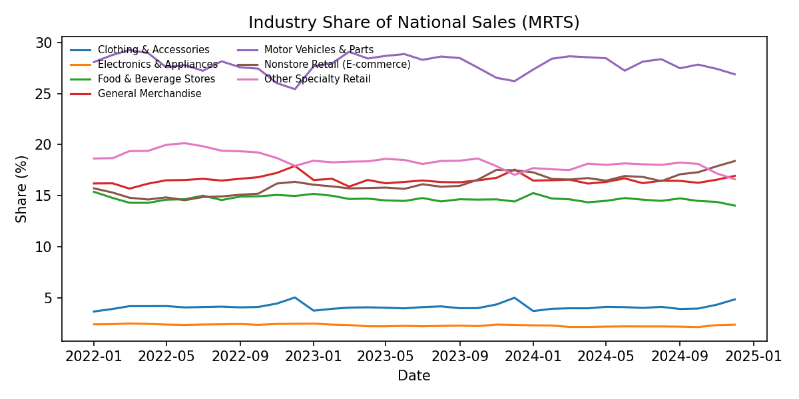
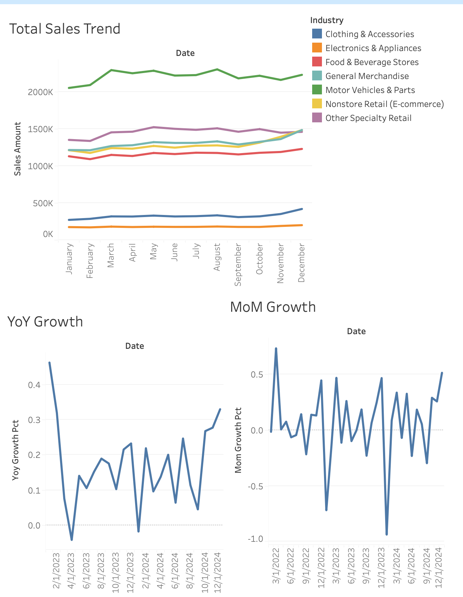
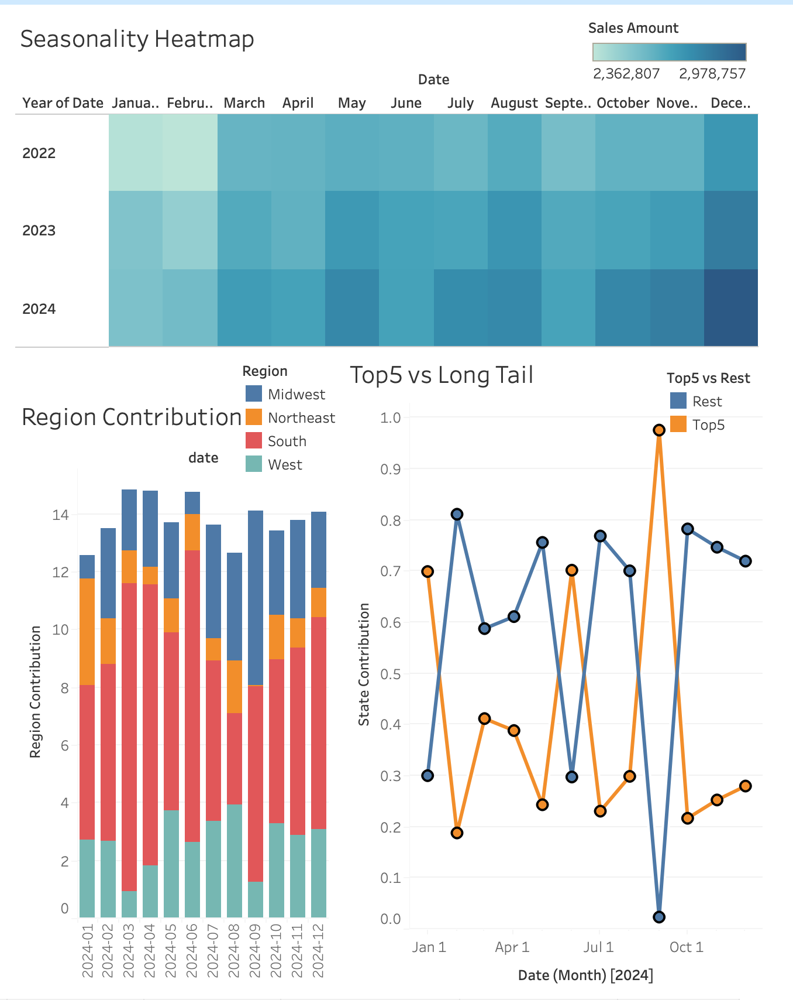
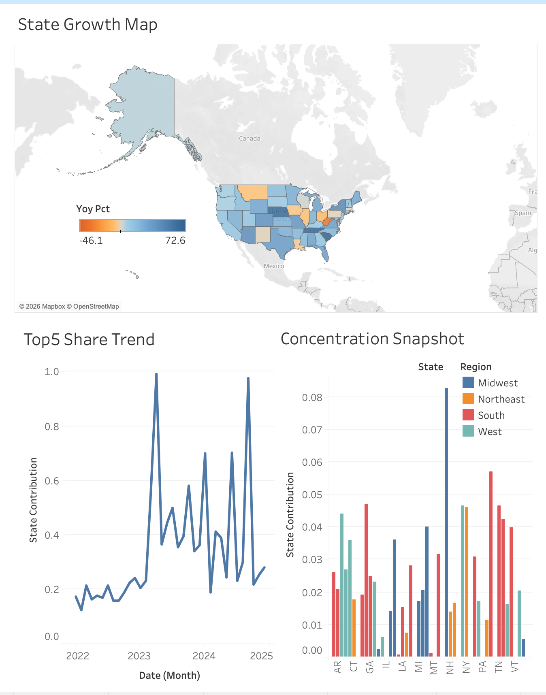
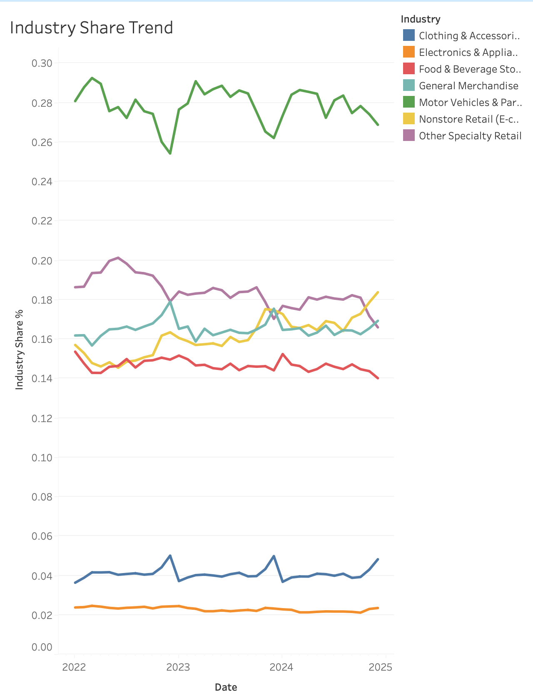

# Market Growth & Competitive Dynamics Analysis (US Retail Market)

## Executive Summary
This project delivers a decision-ready market and growth analysis of the U.S. retail sector using official Census data.
By combining national retail sales levels (MRTS) with state-level growth dynamics (MSRS), the analysis answers three core questions:

- Is the U.S. retail market growing, and how stable is that growth?
- Which regions, states, and industries are driving expansion?
- Is growth becoming increasingly concentrated, introducing structural risk?

The pipeline is fully reproducible, validated, and produces analysis-ready marts and executive dashboards suitable for Market, Growth, and Strategy teams.

## Key Outputs (Quick Review)
- Metrics snapshot: `docs/metrics_snapshot.csv`




### Tableau Dashboards (Static Exports)
**Dashboard 1 — Market Overview (Market Size & Growth)**

- **Insight:** National sales peak in **Dec 2024 ($2.98T)** with clear year‑end seasonality; **YoY 5.19%** and **MoM 5.59%** highlight recent momentum.
- **Explanation:** Tracks total sales, YoY, and MoM to show market size and cyclical patterns.

**Dashboard 2 — Growth Breakdown (Where Growth Comes From)**

- **Insight:** The **South** contributes the largest share of positive growth in **2024 H2 (34.0%)**; Top5 vs Rest shows concentration spikes in months when long‑tail growth is near zero.
- **Explanation:** Region contribution + Top5 vs Long Tail + map explain growth drivers by region/state.

**Dashboard 3 — Risk & Concentration (Growth Dependency)**

- **Insight:** **Top 5 states = 28.0%** of positive growth in **Dec 2024**, down **8.2pp** vs Dec 2023, indicating reduced dependence on a few states.
- **Explanation:** Combines state growth map, Top5 share trend, and latest‑month snapshot to monitor concentration risk.

**Dashboard 4 — Industry Share Trend (Competitive Dynamics)**

- **Insight:** Industry shares are broadly stable with modest shifts; **Motor Vehicles & Parts** leads 2024 YoY momentum, while **Nonstore Retail** shows late‑2024 uplift.
- **Explanation:** Shows national industry mix over time (market structure change), complementing growth‑contribution analysis.

## Quickstart (Reproducibility)
To reproduce the full pipeline end-to-end:
```bash
python -m venv .venv
source .venv/bin/activate
pip install -r requirements.txt

bash scripts/run_pipeline.sh
```

**Expected Outputs**
- `data/processed/fact_national_retail_sales.parquet`
- `data/processed/fact_state_retail_growth.parquet`
- `data/published/fact_national_retail_sales.csv`
- `data/published/fact_state_retail_growth.csv`
- `data/marts/marts_market_trends.parquet`
- `data/marts/marts_growth_contribution.parquet`
- `docs/metrics_snapshot.csv`
- `docs/data_validation.md`
- `docs/figures/*.png`

**Common issues**
- **Network/URL errors:** update file URLs in `config/data_sources.yaml` and re-run `scripts/ingest_*.py`.
- **Schema changes:** if Census updates column names/layout, update parsing logic in `scripts/transform_fact_tables.py` and re-run.

## Business Context
This project evaluates whether the US retail market is growing, where that growth originates, and how concentrated the market has become. The goal is to deliver decision-ready insights that mirror how internal Market/Strategy teams report market size, growth drivers, and concentration risk.

## Data Overview
**Primary datasets (official sources):**
- U.S. Census Bureau — Monthly Retail Trade Survey (MRTS) for national sales levels
- U.S. Census Bureau — Monthly State Retail Sales (MSRS) for state-level YoY growth rates

**Analysis-ready tables (two fact tables, not joined):**
1) `fact_national_retail_sales` (Market Size / Level)
   - `date` (YYYY-MM)
   - `industry`
   - `sales_amount` (national monthly sales level from MRTS)

2) `fact_state_retail_growth` (State Growth Structure / Rate)
   - `date` (YYYY-MM)
   - `state` (CA, TX, NY, ...)
   - `region` (West, South, Midwest, Northeast)
   - `industry`
   - `yoy_pct` (state-level YoY % from MSRS)

**Reporting standard note:**  
State-level growth data is aggregated at the **state–industry–month** level, while national market size is reported at the **industry–month** level, reflecting real-world reporting standards.

**Consistency note:**  
Industry categories are aligned across sources using a standardized retail classification to ensure consistency.

**Data publication constraint note:**  
Due to data publication constraints, market size and growth structure are analyzed using two complementary official sources. National retail sales levels are sourced from MRTS, while state-level growth dynamics are captured using MSRS year-over-year percentage changes.
  
**Growth contribution note:**  
Growth contribution is calculated by normalizing positive year-over-year growth rates only, ensuring that contributions reflect sources of expansion rather than contraction.

**Aggregation note (MSRS):**  
When multiple NAICS codes map to one industry group (e.g., Other Specialty Retail), YoY % is averaged (unweighted) at the state–month–group level due to lack of level weights.

**Source config:**  
Official source URLs are locked in `config/data_sources.yaml` for reproducibility.

**Industry standardization (analysis layer):**
- Food & Beverage Stores
- General Merchandise
- Motor Vehicles & Parts
- Clothing & Accessories
- Electronics & Appliances
- Nonstore Retail (E-commerce)
- Other Specialty Retail

**Coverage note:**  
MSRS state data does not currently include NAICS 454 (Nonstore Retail), so state-level outputs may show 6 groups.

## Data Constraints & Design Decisions
Due to official data publication constraints, no single dataset provides both monthly sales levels and state-level industry detail.
To reflect real-world analytical practice, this project intentionally separates:

- **Market size and trend (levels):** National Monthly Retail Trade Survey (MRTS)
- **Growth structure and concentration (rates):** Monthly State Retail Sales (MSRS, YoY %)

These datasets are not merged at the row level. Instead, they are analyzed in parallel to preserve data integrity and interpretability.

## Key Metrics
**Market Size & Growth**
- Total Sales
- YoY Growth
- MoM Growth

**Growth Contribution**
- State contribution (%)
- Region contribution (%)
- Industry contribution (%)

**Concentration & Risk**
- Top 5 / Top 10 states share
- Top industry share
- Growth dependency ratio

## Growth Contribution Methodology
Growth contribution is calculated using positive-only year-over-year (YoY) growth normalization:

- Negative YoY values are floored at zero.
- Contributions are normalized by the sum of all positive YoY values within the same period (and industry where applicable).

This approach ensures that:
- Contributions represent sources of expansion, not contraction.
- Results remain interpretable even when aggregate growth is near zero.

**Limitation:**  
This method emphasizes growth drivers and may understate the impact of declining regions or industries. A signed-normalization alternative is discussed in `docs/methodology_growth_contribution.md`.

## Market Trends
**What is analyzed (SQL / pandas, MRTS):**
- National total sales trend (level)
- YoY / MoM growth (level-based)
- Monthly seasonality patterns

**Tableau dashboard: Market Overview**
- Line chart: Total Sales
- YoY bar chart
- Seasonality heatmap (Month × Year)


## Growth Drivers
This is the core value of the project — decomposing growth across three dimensions only (MSRS YoY %):

**a) Regional Contribution**  
Which regions contribute the most to total growth.

**b) State Contribution**  
Top 5 states vs. the rest of the US.

**c) Industry Contribution**  
Which industries are pulling the market forward.

**Tableau dashboard: Growth Breakdown**
- Stacked bar (growth contribution)
- Map (state-level growth)
- Top vs. Long Tail comparison


## Market Concentration & Risk
**Focus (MSRS YoY %):**
- Top 5 states share of growth
- Top industry share of growth
- Trend of concentration over time

**Tableau dashboard: Risk & Concentration**
- Top N share trend line
- Concentration snapshot
- Risk callout (text)
- Industry share trend (MRTS, market structure)

## Competitive Dynamics Interpretation
In this project, competitive dynamics are assessed through changes in growth concentration and industry mix, rather than firm-level competition.

Key lenses include:
- **Top-N state growth concentration:** Are fewer states accounting for a larger share of total growth?
- **Industry contribution shifts:** Which retail categories consistently lead or lag market expansion?
- **Stability vs. volatility:** Are growth drivers persistent or episodic?

This framing mirrors how strategy teams evaluate structural competitiveness when firm-level data is unavailable.

## Strategic Implications
- **Where to invest:** Prioritize regions and states that consistently drive positive growth contribution.
- **Where to monitor risk:** Track dependence on top states and leading industries as concentration changes.
- **Market health:** Stable long-term growth with strong seasonality suggests a healthy but cyclical market; concentration trends determine resilience vs. vulnerability.

## Data Governance & Validation
This project includes a dedicated data validation layer to ensure analytical integrity:

- Coverage completeness (36/36 months)
- Primary key uniqueness (0 duplicates)
- Missing value monitoring
- Value range checks for YoY growth
- Industry classification consistency
- State-to-region mapping completeness

Detailed results are documented in `docs/data_validation.md`.

## Technical Implementation
**SQL (core logic)**
- MRTS: `GROUP BY date, industry`, `SUM(sales_amount)`
- MRTS: `LAG() OVER (PARTITION BY industry ORDER BY date)` for YoY / MoM
- MSRS: `GROUP BY date, state, industry`, contribution share math on positive-only `yoy_pct`

**SQL marts**
- `sql/marts_market_trends.sql`
- `sql/marts_growth_contribution.sql`

**Python (pandas)**
- Data cleaning
- MRTS YoY / MoM calculations
- MSRS contribution calculations

**Pipeline scripts**
- `scripts/ingest_mtrs.py` (download MRTS files from config)
- `scripts/ingest_msrs.py` (download MSRS files from config)
- `scripts/transform_fact_tables.py` (build fact tables)
- `scripts/run_pipeline.sh` (end-to-end run)

**Reference mappings**
- `data/reference/industry_crosswalk.csv` (NAICS → analysis industry group)
- `data/reference/state_region_map.csv` (state → region)

**Data outputs**
- `data/processed/*.parquet` (primary analysis output)
- `data/published/*.csv` (sharing / Tableau-friendly output)
- `data/marts/*.parquet` (materialized marts)
- `data/published/marts_*.csv` (Tableau default source)
- `docs/data_validation.md` (data quality checks)
- `docs/metrics_snapshot.csv` (latest KPIs)
- `docs/figures/*.png` (key visuals)

**Documentation**
- `docs/methodology_growth_contribution.md` (audit methodology + sensitivity check)
- `docs/data_dictionary.md` (field definitions)
- `docs/data_lineage.md` (pipeline lineage)

**Quality checks**
- `docs/data_validation.md` (coverage, uniqueness, missingness, range)
- `tests/` (pytest data quality checks)
- `.github/workflows/ci.yml` (lightweight CI)

**Scope constraints**
- No modeling
- No forecasting
- No machine learning

## Intended Use Case
This analysis is designed to support market sizing, regional investment prioritization, and concentration risk monitoring for strategy and growth planning teams.

## Tableau Dashboards
Interactive dashboards are built directly on the analytics marts or published CSV outputs.

To connect Tableau:
- Primary source: `data/published/*.csv`
- Alternative: SQL marts in `sql/`

Dashboard specifications are documented in `tableau/dashboard_spec.md`.
Static preview images are available in `docs/figures/`.

**Tableau workbook**
- Expected file: `tableau/market_growth_competitive_dynamics.twbx`
- Instructions: `tableau/README.md`

## Limitations
- State-level analysis relies on growth rates (YoY %) rather than sales levels due to data availability.
- Industry coverage differs slightly between MRTS (7 groups) and MSRS (6 groups).
- Concentration metrics reflect growth dependency, not absolute market share.

These constraints reflect real-world public data limitations and are explicitly incorporated into the analysis design.
